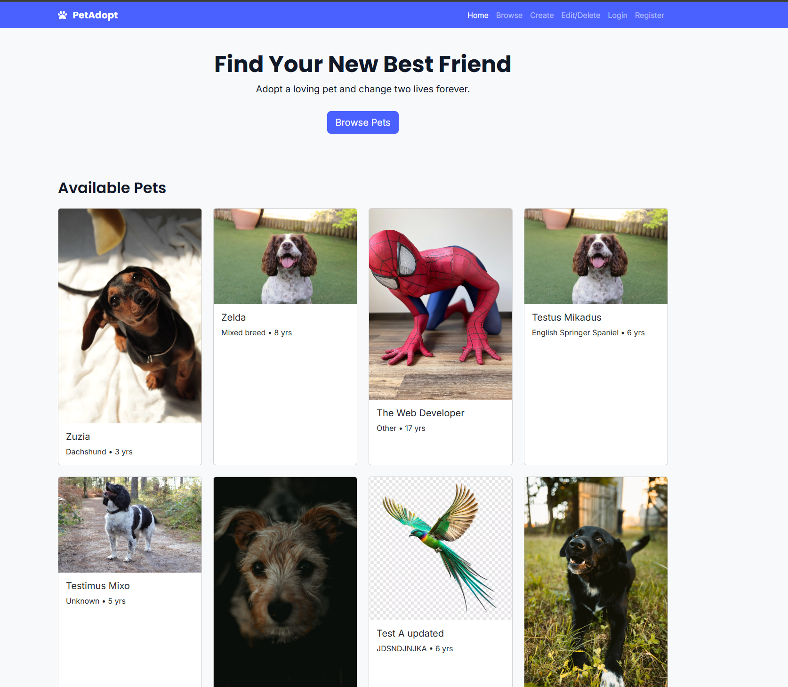
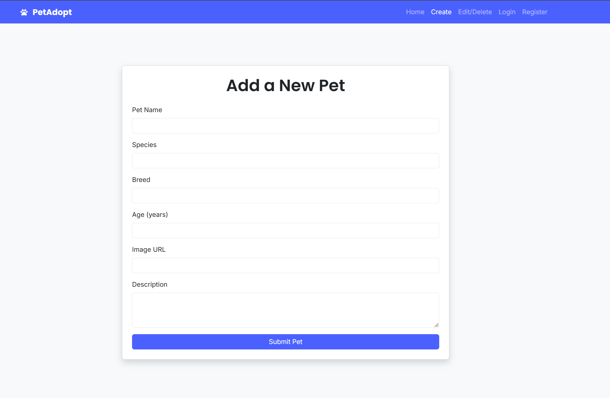
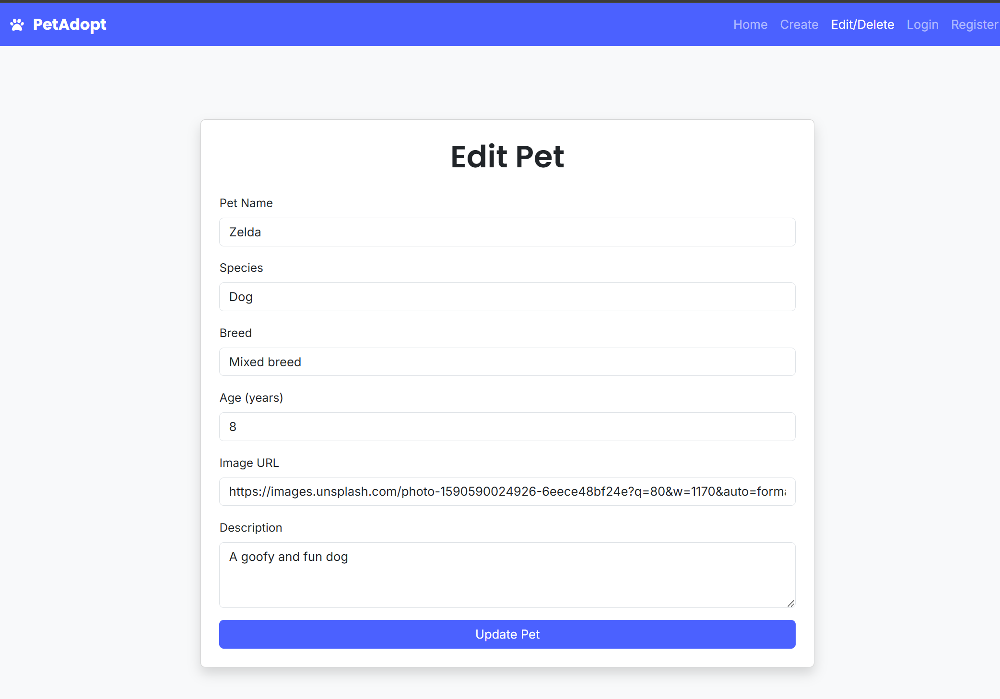

# PetAdopt – Responsive Pet Adoption Web Application

> A modern, accessible, and responsive front-end application built with HTML, CSS, JavaScript, and Bootstrap. Users can view adoptable pets, and admins can manage pet listings with secure authentication.

---

## Screenshots

  
  

---

## Features

### Public User Features:

- View a grid of available pets
- Click to view details (optional expansion)
- Mobile-friendly, fast-loading layout

### Admin Features:

- Register + Login securely
- Add new pets (POST)
- Edit existing pets (PUT)
- Delete pets (DELETE)
- Protected routes (create/edit pages require login)

---

## Tech Stack

### Built with:

- HTML5
- CSS3 (with Bootstrap 5)
- JavaScript (Vanilla)
- Font Awesome + Bootstrap Icons
- Noroff API v2 (`https://v2.api.noroff.dev`)
- Mobile-first responsive design
- WCAG accessible color contrast & form labeling

---

## Authentication

- Uses JWT token stored in `localStorage`
- Protected pages check for token before access
- Valid registration requires a `@stud.noroff.no` email

---

## Responsiveness Tested On

- iPad Mini
- iPad Pro
- Surface Pro
- Mobile phones (iOS & Android)
- Desktop / widescreen
- Slow 3G and offline fallback behavior

---

## Deployment

**Live site:** [sems-project-2.netlify.app](https://sems-project-2.netlify.app/)  
**GitHub repo:** [github.com/si-rak/Sems-Project-2](https://github.com/si-rak/Sems-Project-2)

---

## Acknowledgements

I’d like to sincerely thank the Noroff staff whose guidance and feedback made this project possible. I also referenced official Noroff resources, helpful YouTube tutorials, and occasionally turned to ChatGPT for clarification when stuck. All of it helped deepen my understanding throughout the process.

---

## Feedback & Reflection

This project has been an incredibly valuable learning experience. I’ve improved not only my technical skills, but also my eye for detail and confidence in UI development. Although I usually prefer Tailwind CSS, I opted for Bootstrap in this project due to its simpler setup, especially around npx limitations.

The course also made me realize how much focus and consistency front-end development requires. I’m proud of the growth I’ve made and excited to keep building from here.

---

## Accessibility & Testing

- Keyboard navigation tested
- Color contrast passes WCAG AA
- Forms are properly labeled
- Throttled API tested for loading indicators
- Mobile breakpoints manually tested

---

## Author

Built by **Sirak Getachew** as part of **Noroff Front-End Semester Project 2**  
Cohort: FED2 2024

---

## License

This project is licensed for educational use as part of Noroff coursework.

---

---

## Admin Credentials (for testing only)

> Provided for grading purposes. No sensitive data stored.

- Email: zebeaman@stud.noroff.no
- Password: mysecurepass123
